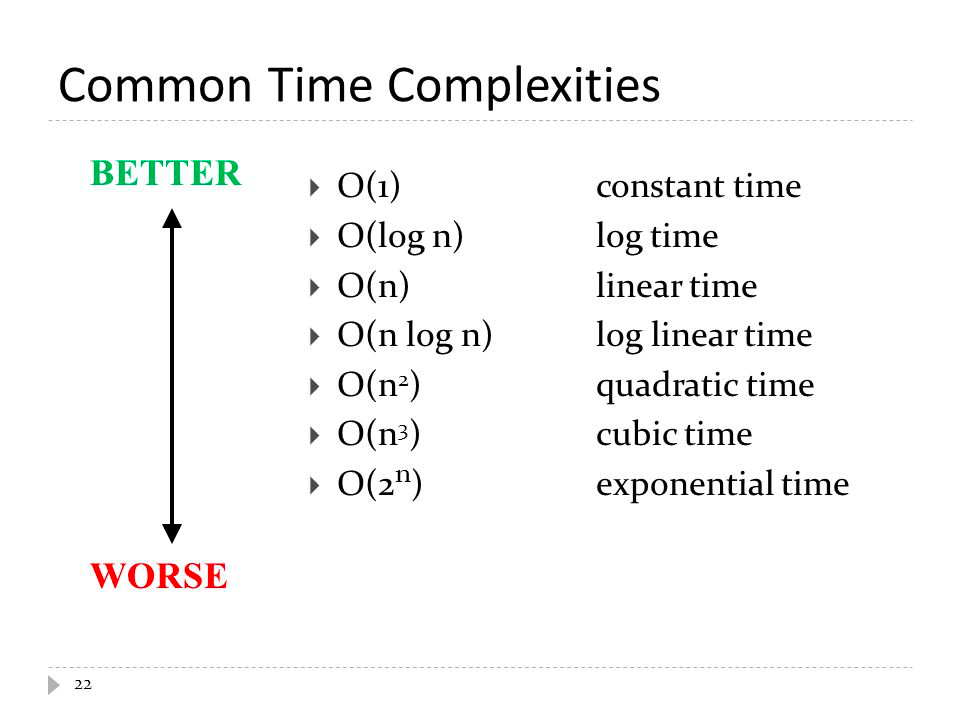

# Big O Notation



## [A beginner's guide to Big O notation](https://rob-bell.net/2009/06/a-beginners-guide-to-big-o-notation/)

Big O notation is used in Computer Science to describe the performance or complexity of an algorithm. Big O specifically describes the worst-case scenario, and can be used to describe the execution time required or the space used \(e.g. in memory or on disk\) by an algorithm.

Anyone who's read [Programming Pearls](https://www.amazon.com/Programming-Pearls-2nd-Jon-Bentley/dp/0201657880/ref=as_li_ss_tl?&imprToken=9UGy2f7-qyMHt7vt50adpw&slotNum=0&s=books&ie=UTF8&qid=1515001049&sr=1-1&keywords=programming+pearls&linkCode=ll1&tag=robbell-20&linkId=8d74e3c36a9652808aa9a59442b49036) or any other Computer Science books and doesn’t have a grounding in Mathematics will have hit a wall when they reached chapters that mention O\(N log N\) or other seemingly crazy syntax. Hopefully this article will help you gain an understanding of the basics of Big O and Logarithms.

As a programmer first and a mathematician second \(or maybe third or fourth\) I found the best way to understand Big O thoroughly was to produce some examples in code. So, below are some common orders of growth along with descriptions and examples where possible.

### O\(1\)

O\(1\) describes an algorithm that will always execute in the same time \(or space\) regardless of the size of the input data set.

```text
bool IsFirstElementNull(IList<string> elements)
{
    return elements[0] == null;
}
```

### O\(N\)

O\(N\) describes an algorithm whose performance will grow linearly and in direct proportion to the size of the input data set. The example below also demonstrates how Big O favours the worst-case performance scenario; a matching string could be found during any iteration of the `for` loop and the function would return early, but Big O notation will always assume the upper limit where the algorithm will perform the maximum number of iterations.

```text
bool ContainsValue(IList<string> elements, string value)
{
    foreach (var element in elements)
    {
        if (element == value) return true;
    }

    return false;
}
```

### O\(N2\)

O\(N2\) represents an algorithm whose performance is directly proportional to the square of the size of the input data set. This is common with algorithms that involve nested iterations over the data set. Deeper nested iterations will result in O\(N3\), O\(N4\) etc.

```text
bool ContainsDuplicates(IList<string> elements)
{
    for (var outer = 0; outer < elements.Count; outer++)
    {
        for (var inner = 0; inner < elements.Count; inner++)
        {
            // Don't compare with self
            if (outer == inner) continue;

            if (elements[outer] == elements[inner]) return true;
        }
    }

    return false;
}
```

### O\(2N\)

O\(2N\) denotes an algorithm whose growth doubles with each additon to the input data set. The growth curve of an O\(2N\) function is exponential - starting off very shallow, then rising meteorically. An example of an O\(2N\) function is the recursive calculation of Fibonacci numbers:

```text
int Fibonacci(int number)
{
    if (number <= 1) return number;

    return Fibonacci(number - 2) + Fibonacci(number - 1);
}
```

### Logarithms

Logarithms are slightly trickier to explain so I'll use a common example:

[Binary search](http://en.wikipedia.org/wiki/Binary_search) is a technique used to search sorted data sets. It works by selecting the middle element of the data set, essentially the median, and compares it against a target value. If the values match it will return success. If the target value is higher than the value of the probe element it will take the upper half of the data set and perform the same operation against it. Likewise, if the target value is lower than the value of the probe element it will perform the operation against the lower half. It will continue to halve the data set with each iteration until the value has been found or until it can no longer split the data set.

This type of algorithm is described as **O\(log N\)**. The iterative halving of data sets described in the binary search example produces a growth curve that peaks at the beginning and slowly flattens out as the size of the data sets increase e.g. an input data set containing 10 items takes one second to complete, a data set containing 100 items takes two seconds, and a data set containing 1000 items will take three seconds. Doubling the size of the input data set has little effect on its growth as after a single iteration of the algorithm the data set will be halved and therefore on a par with an input data set half the size. This makes algorithms like binary search extremely efficient when dealing with large data sets.

_This article only covers the very basics or Big O and logarithms. For a more in-depth explanation take a look at their respective Wikipedia entries:_ [_Big O Notation_](http://en.wikipedia.org/wiki/Big_O_notation)_,_ [_Logarithms_](http://en.wikipedia.org/wiki/Logarithm)_._

